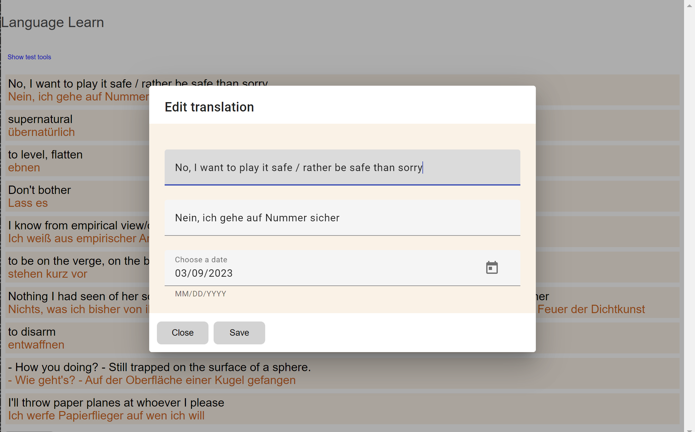

# LanguageLearn

This project was generated with [Angular CLI](https://github.com/angular/angular-cli) version 16.1.3, and currently working with **17.3.1**. In addition it now contains a .NET Core 8 C# project for an in memory back end.

This is a project to practice and consolidate Angular development, including **Angular Materials**, and the **Jest** framework.
It reimagines a previous application, LanguageLearn, that I wrote in C++ for my own desktop Windows environment and occasionally ported for newer versions of Visual Studio. This new application will be simplified however. The original idea was to create a spaced repetition system that tracked the user's success in recalling phrases translating between English and German and offered them more frequently if the user was having trouble with them.

I still use the original system every day, using a database of 33000 words and phrases I've built up over the years. Much of the original functionality turned out to be superfluous though, and I use it in a simpler way than I originally envisaged. This project reimagines the application more simply, and so that it will no longer be dependent on running on my desktop PC and could be used on the go.

## Learnings from the original system

- It became apparent as the contents of cards became more ambitious that it wasn't appropriate or useful to judge success or failure in recalling individual items any more.
- A system that offers all due items simultaneously is better than one that offers translations in sequence, because it allows the user to visually go back and forwards between due items to their own satisfaction and reinforce items that need more reinforcing.
- Metrics of overall success or progress aren't useful, motivational or necessary to me - this isn't Duolingo.
- The original application never offered editing for phrases, which had to be added or edited in a raw text file where they were stored.

## To do

I expect to extend the current state of the project in the following ways:
- extend the coverage in Jest - in particular in testing Angular Materials
- we have no persistence yet (relying on an in memory database).

## Install other necessary components

`npm i jest @types/jest jest-preset-angular`

`ng add @angular/material`

`npm i @angular/material-moment-adapter`

`npm i moment`

`npm i angular-in-memory-web-api --save`

## Development server

Run `npm start` for a dev server. Navigate to `http://localhost:4200/`. The application will automatically reload if you change any of the source files.

## Code scaffolding

Run `ng generate component component-name` to generate a new component. You can also use `ng generate directive|pipe|service|class|guard|interface|enum|module`.

## Build

Run `ng build` to build the project. The build artifacts will be stored in the `dist/` directory.

## Running unit tests

Run `ng test` to execute the unit tests via [Karma](https://karma-runner.github.io).

## Running end-to-end tests

Run `ng e2e` to execute the end-to-end tests via a platform of your choice. To use this command, you need to first add a package that implements end-to-end testing capabilities.

## Further help

To get more help on the Angular CLI use `ng help` or go check out the [Angular CLI Overview and Command Reference](https://angular.io/cli) page.
